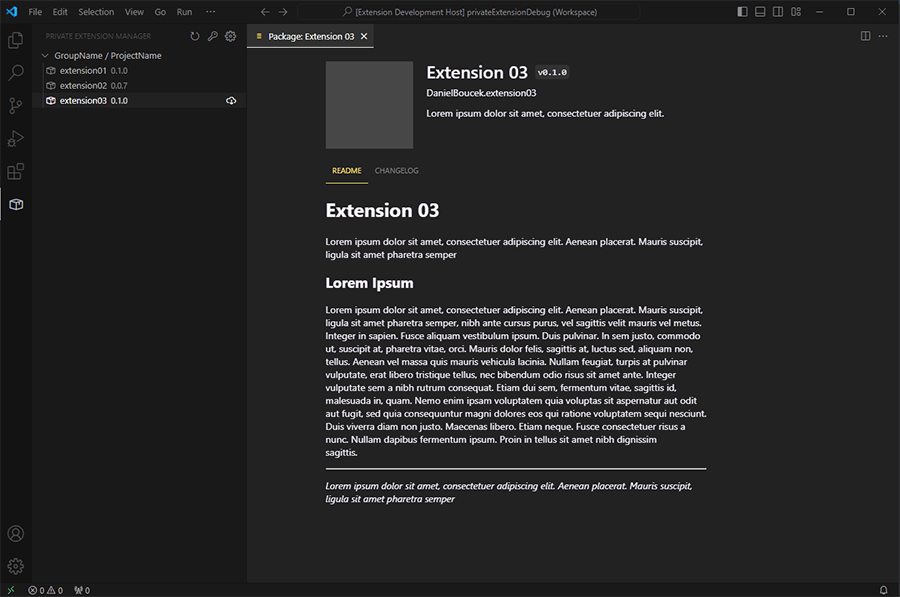

# Private Extension Manager

This extension allows you to browse, display and install private extensions using GitLab's package registry API.

This extension works best if you keep automatic updates on, usually you still need to then restart the extension host in the default Extensions panel. Updates are checked only on each startup or you can refresh manually.



## Extension Setup

- Set your Gitlab access token using the command `Set GitLab Access Token`, this token is stored securely in vscode's SecretStorage and is not exposed. You can use personal token or project token scoped at least for `read_api`
- Set your Gitlab's package registry API URL of your project. You can add multiple URLs if you want to group your extensions in different projects.
- Optional: If a user and his token do not have access to the project repository you can change the general settings to `Allow anyone to pull from Package Registry`

```
https://gitlab.example.com/api/v4/projects/012345/packages
```

_Replace the domain and the number with your actual project id. When opened in a browser this URL should return a JSON response with your packages._

## Repository Setup

You should create a new repository and enable the package registry if disabled. Then make a `.gitlab-ci-config.yml` file and a simple script to package and push the .vsix files to the package registry.

You need to link that .yml config in each repository with the different extensions. If you will use $CI_JOB_TOKEN, you also need to `Allow CI job tokens from the following projects to access this project` Meaning the project with the packages.

**It is important to name the packages the same as the extension identifier: `publisherName.extensionName`**

```yml
deploy:
  image: node:20.15.0
  stage: deploy
  script:
    - PUBLISHER=$(node -p "require('./package.json').publisher")
    - NAME=$(node -p "require('./package.json').name")
    - PACKAGE_NAME="$PUBLISHER.$NAME"
    - PACKAGE_VERSION=$(node -p "require('./package.json').version")

    - npm install -g @vscode/vsce
    - npm ci
    - vsce package --allow-missing-repository --skip-license
    - VSIX_FILE=$(ls *.vsix)

    - URL="$CI_API_V4_URL/projects/012345/packages/generic/$PACKAGE_NAME/$PACKAGE_VERSION/$VSIX_FILE"
    - 'curl --cacert $CI_SERVER_TLS_CA_FILE --fail-with-body --header "JOB-TOKEN: $CI_JOB_TOKEN" --upload-file "$VSIX_FILE" "$URL"'
```

_This script is not necessarily right, feel free to write your own config, add some version checking, multiple stages, etc._

### Known Issues

- There are some issues regarding the extension host and visibility of the disabled extension.
- Loading indicator when fetching packages does not work properly.

